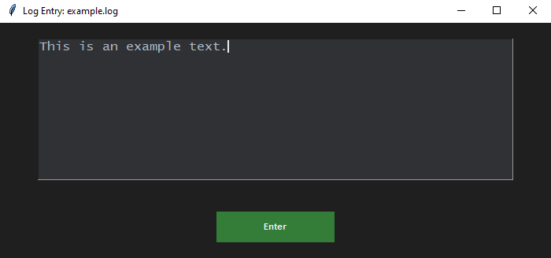
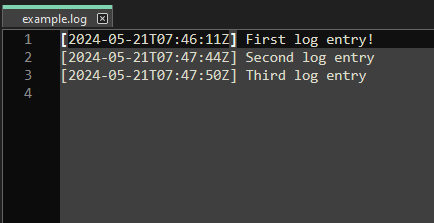

# cmdlog GUI

cmdlog GUI is a UI interface for manual log entry into log files

```shel
$ python cmdlog-gui.py example.log
```





This python application is a UI wrapper around the 
[cmdlog](https://github.com/etcetra7n/cmdlog) application. 
So you would need to install that first.
